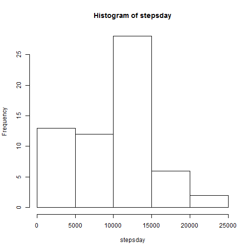
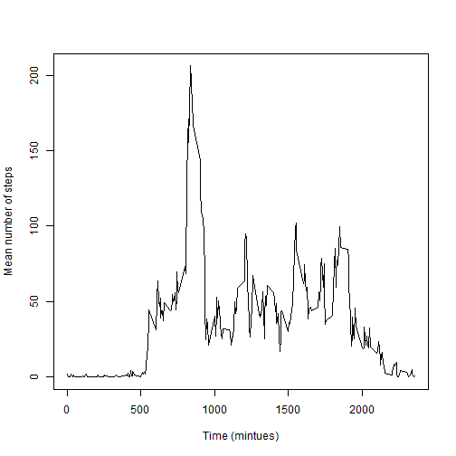
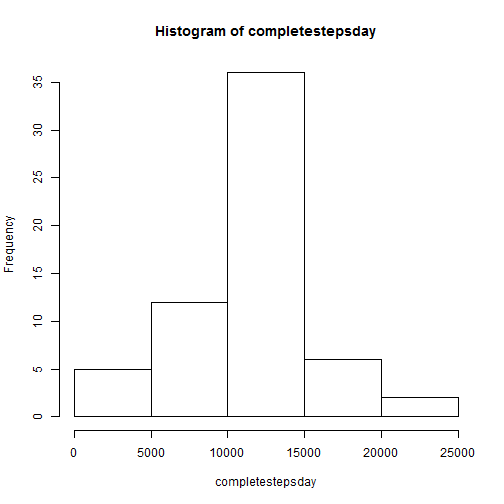
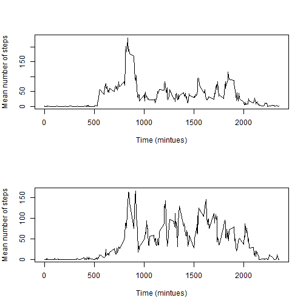

## Loading and preprocessing the data

We first unzip the data file, load the data, then convert the date column into a date object, and the interval column into a factor


```r
setwd("C:/Users/Robin/Dropbox/Coursera/Rep")
# unzip("activity.zip") #only need to unzip once
rawdata<-read.csv("activity.csv")
rawdata$date<-as.Date(rawdata$date) #date is in a standard format
rawdata$interval<-factor(rawdata$interval)
```


## What is mean total number of steps taken per day?

We caluclate the sum of all the steps counted each day. We treat the missing values as 0 (i.e. if a day is missing all values then it is still inlcuded, but the total steps for that day is set as zero)


```r
stepsday<-with(rawdata,tapply(steps,date,sum,na.rm=TRUE))
hist(stepsday)
```

 

```r
mean(stepsday)
```

```
## [1] 9354.23
```

```r
median(stepsday)
```

```
## [1] 10395
```

## What is the average daily activity pattern?

We now wish to calculte the mean number of steps in each interval. For this calculation we remove the missing values


```r
stepsinterval<-with(rawdata,tapply(steps,interval,mean,na.rm=TRUE))
plot(as.integer(levels(rawdata$interval)),stepsinterval,type="l",
     xlab="Time (mintues)",ylab="Mean number of steps")
```

 

```r
maxsteps<-max(stepsinterval)
maxinterval<-which.max(stepsinterval) # first number is the interval, second is the index
```

The maximum average number of steps is 206.1698113 and this happens in the 5 minute interval starting at minute 835


## Imputing missing values

How many missing values are there?


```r
sum(is.na(rawdata$date))
```

```
## [1] 0
```

```r
sum(is.na(rawdata$interval))
```

```
## [1] 0
```

```r
numna <- sum(is.na(rawdata$steps))
print(numna)
```

```
## [1] 2304
```

There are 2304 missing values and they are all in the steps column.

For our imputing strategy, we will replace the missing value with the mean value for that interval averaged over all days


```r
nas<-is.na(rawdata$steps)
missing<-rawdata[nas,]
missing$interval<-as.character(missing$interval) #change back to character
imputed<-stepsinterval[missing$interval]
```

We then create a new data frame with the filled in values and check there are no more nas


```r
complete<-rawdata
complete[nas,1]<-imputed
sum(is.na(complete))
```

```
## [1] 0
```

We can finally calculate the mean and median steps per day with this complete set


```r
completestepsday<-with(complete,tapply(steps,date,sum,na.rm=TRUE))
hist(completestepsday)
```

 

```r
mean(completestepsday)
```

```
## [1] 10766.19
```

```r
median(completestepsday)
```

```
## [1] 10766.19
```

We can see that this has significantly changed the distribution and has changed both the mean and median.

## Are there differences in activity patterns between weekdays and weekends?

First we make a list of weekdays and weekend days


```r
wkday<-c("Monday","Tuesday","Wednesday","Thursday","Friday")
weday<-c("Saturday","Sunday")
```

Then we make a new column inthe complete dataframe showing whether it is a weekday or weekend


```r
complete$daytype<-factor( (weekdays(complete$date) %in% wkday) + (weekdays(complete$date) %in% weday)*2 )
levels(complete$daytype)<-c("Weekday","Weekend")
```

We now calculate the require data


```r
stepsintsplit<-with(complete,
                    tapply(steps,list(interval,daytype),mean,na.rm=TRUE))
stepsintsplit<-data.frame(stepsintsplit)
stepsintsplit$interval<-levels(complete$interval)
par(mfrow=c(2,1),mar=c(5, 4, 4, 2))
with(stepsintsplit,plot(interval,Weekday,type="l",
                        xlab="Time (mintues)",ylab="Mean number of steps"))
with(stepsintsplit,plot(interval,Weekend,type="l",
                        xlab="Time (mintues)",ylab="Mean number of steps"))
```

 


